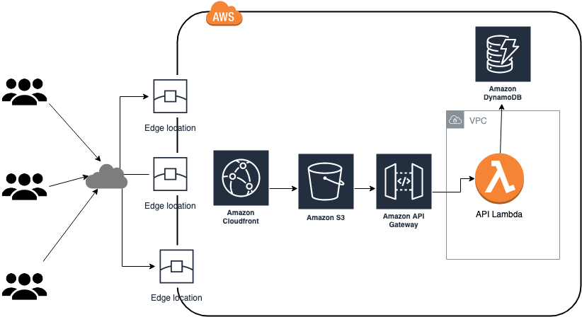

# Ejemplo Serverless

## backend
Contiene el codigo de las funciones Lambda y codigo para despliegue automatizado

## infra
Contiene codigo para el despliegue de la infrastructura base

## setup
Contiene scripts para llenar la base de datos con datos prueba

## webapp
Contiene una pagina web que interactua con un API Gateway para obtener y enviar datos
